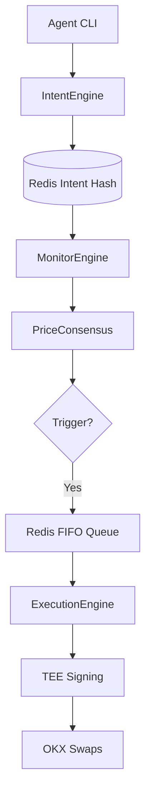

# OKX DEX Limit Order Skill

A production-grade, highly scalable autonomous trading primitive built for the OnChain OS ecosystem. This skill enables AI agents and high-frequency traders to manage complex limit orders with TEE-signed transitions and multi-source price consensus.

## 🏗 Architecture Overview

The system operates as a stateful intent machine backed by Redis.



### 10-State Intent Lifecycle
Every swap follows a deterministic lifecycle. Every transition is TEE-signed and recorded in `lo:audit`.

| State | Description |
|---|---|
| **PENDING** | Order created, awaiting final validation. |
| **MONITORING** | Active patrolling of the price feed. |
| **TRIGGERED** | Price hit target, moved to execution queue. |
| **SUBMITTED** | Transaction broadcast to network. |
| **CONFIRMED** | 12-block confirmation achieved. |
| **SETTLED** | Terminal success. Intent satisfied. |
| **FAILED** | Logic or pre-flight failure. |
| **REVERTED** | On-chain reversal. |
| **CANCELLED** | User-initiated or expiry termination. |
| **STALE** | Price feed lost confidence. |

## 🛠 Features

- **Multi-Source Price Consensus**: Blends OKX WS (50%), Chainlink (30%), and Binance (20%) with variance guards.
- **Idempotency**: SHA-256 intent keys prevent duplicate executions within 60-second windows.
- **High Concurrency**: BLPOP architecture allows execution workers to scale horizontally to 20+ replicas.
- **Audit Trails**: TEE-signed state transitions provide a path-dependent proof of intent and execution.

## 🚀 Getting Started

### Prerequisites
- Node.js 20+
- Redis 7.0 (Sentinel mode recommended)
- TEE Environment (or HMAC fallback)

### Installation
```bash
npm install
npm run build
```

### Running Workers
```bash
# Start Price Monitor
npm run monitor

# Start Execution Worker
npm run execution
```

## 🧰 Agent Tools

| Script | Purpose |
|---|---|
| `place_order.js` | Create a new LIMIT or OCO order. |
| `list_orders.js` | List orders by status or user. |
| `get_order.js` | Full audit trail and signatures for an ID. |
| `cancel_order.js` | Terminate a monitoring order. |
| `diagnostics.js` | System health and connectivity check. |
